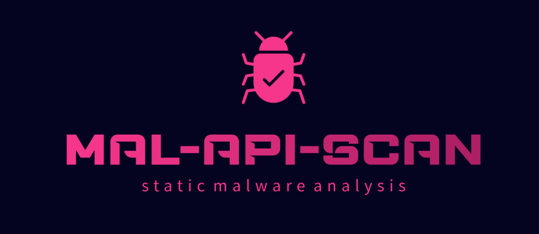

# Mal-API-Scan

## Overview

Mal-API-Scan is a command-line utility designed to analyze the API calls made by executable files (PE files). It identifies suspicious API calls based on predefined categories sourced from malapi.io (https://malapi.io/) and outputs the results in a readable format. The tool can recursively analyze DLLs imported by the executable and provide insights into potential malicious behaviors.

## Features

- **Suspicious API Detection**: Identifies APIs categorized as suspicious (e.g., related to enumeration, injection, evasion, etc.).
- **Recursive Analysis**: Recursively analyzes DLLs imported by the executable.
- **Output Options**: Results can be displayed in the console or saved to a CSV file.
- **User-Friendly Output**: Uses colored console output for better readability.

## Requirements

- Python 3.x
- Required libraries:
  - `pefile`
  - `prettytable`
  - `cxxfilt`
  - `colorama`

## Installation

1. Clone the repository or download the script.
2. Install the required Python libraries using pip:

    ```bash
    pip install pefile prettytable cxxfilt colorama
    ```

3. Ensure you have the suspicious API definition files in the `malware-categories` directory. These files should be named as follows:
   - `enumeration.txt`
   - `injection.txt`
   - `evasion.txt`
   - `spying.txt`
   - `internet.txt`
   - `anti-debugging.txt`
   - `ransomware.txt`
   - `helper.txt`

## Usage

Run the tool from the command line with the following syntax:

```bash
python mal-api-scan.py <exe_path> [-s] [-r] [-o <output_file.csv>]
```

### Arguments

- `<exe_path>`: The path to the executable file you want to analyze.
- `-s`, `--suspicious`: Show only suspicious API calls with depth 0 (direct calls from the executable).
- `-r`, `--recursive`: Show all suspicious API calls, including those from imported DLLs.
- `-o <output_file.csv>`, `--output <output_file.csv>`: Save the output to a specified CSV file.

### Example

To analyze an executable file and show all suspicious API calls recursively:

```bash
python mal-api-scan.py path/to/your/executable.exe -r
```

To analyze an executable file and only show direct suspicious API calls, saving the output to a CSV file:

```bash
python mal-api-scan.py path/to/your/executable.exe -s -o output.csv
```

## Output

The results will be displayed in a table format in the console or saved in the specified CSV file. Each entry includes:

- **File**: The file name of the executable or DLL.
- **Imported DLL**: The name of the imported DLL.
- **API Call**: The API call made, with a link to its information on malapi.io.
- **Depth**: The depth of the API call (how far down the call chain it is).
- **Category**: The category of the API call (e.g., enumeration, injection).
- **Caller Chain**: The sequence of calls leading to the API call.

## Color Coding

The console output is color-coded for better readability:
- **Green**: For successful operations and information.
- **Yellow**: For warnings and informational messages.
- **Red**: For error messages.

## Contributing

Contributions are welcome! If you have suggestions for improvements or features, feel free to create an issue or submit a pull request.

## License

This project is licensed under the MIT License. See the LICENSE file for details.
